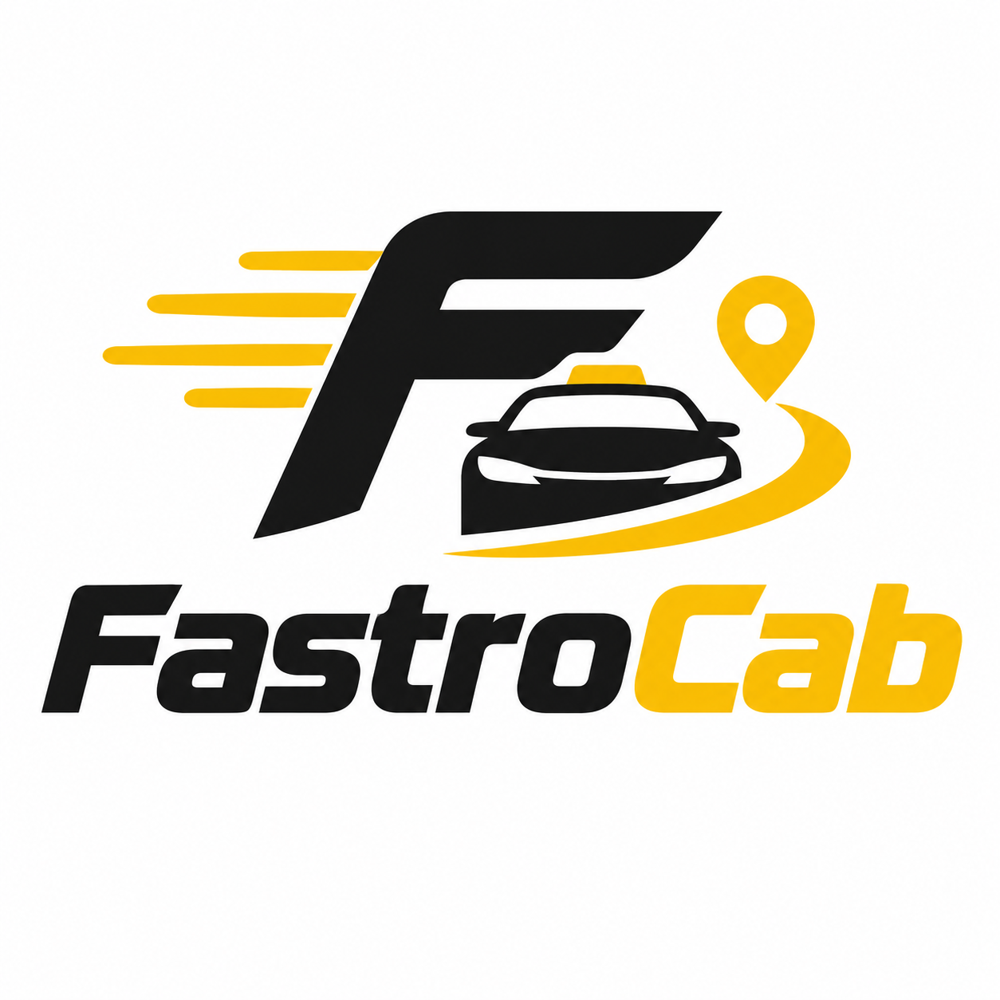

<!-- ============================================================ -->
<!--                  FASTROCAB OFFICIAL GITHUB                   -->
<!-- ============================================================ -->

  

 

  <strong>SMART MOBILITY • POWERED BY TECHNOLOGY</strong>

A modern ride-booking ecosystem connecting riders and captains 
through fast, reliable and seamless technology.

 

&nbsp;&nbsp;

  

 

---

## `// THE JOURNEY STARTS HERE`

       ┌──────────────────────────────────────────────────────┐
       │                                                      │
       │                   F A S T R O C A B                  │
       │                         🚕                           │
       │                                                      │
       │              YOUR RIDE  •  YOUR WAY                  │
       │                                                      │
       └──────────────────────────────────────────────────────┘

       

Transportation should feel effortless.

FastroCab brings together riders, captains and technology
to create a smarter and more connected ride experience.

  

01 / EXPERIENCE FASTROCAB
Everything you need. One connected platform.

   <table> <tr> <td width="33%" align="center">
👤
RIDERS

Book rides effortlessly.

Track your journey.

Travel with confidence.

SEARCH → BOOK → RIDE

</td> <td width="33%" align="center">
🚘
CAPTAINS

Connect with riders.

Manage your trips.

Keep moving forward.

REQUEST → ACCEPT → DRIVE

</td> <td width="33%" align="center">
🖥️
OPERATIONS

Manage the ecosystem.

Monitor activity.

Keep everything connected.

MONITOR → MANAGE → SCALE

</td> </tr> </table>  

02 / ONE ECOSYSTEM

                              ┌───────────────┐
                              │   FASTRO 🚕   │
                              │      CAB      │
                              └───────┬───────┘
                                      │
                                      │
                 ┌────────────────────┼────────────────────┐
                 │                    │                    │
                 ▼                    ▼                    ▼

          ┌─────────────┐      ┌─────────────┐      ┌─────────────┐
          │    RIDER    │      │   CAPTAIN   │      │    ADMIN    │
          │      👤     │      │      🚘     │      │      🖥️     │
          └──────┬──────┘      └──────┬──────┘      └──────┬──────┘
                 │                    │                    │
                 └────────────────────┼────────────────────┘
                                      │
                         ┌────────────┴────────────┐
                         │                         │
                         ▼                         ▼
                  ┌─────────────┐          ┌─────────────┐
                  │     WEB     │          │   MOBILE    │
                  │      🌐     │          │      📱     │
                  └──────┬──────┘          └──────┬──────┘
                         │                         │
                         └────────────┬────────────┘
                                      │
                                      ▼
                              ┌───────────────┐
                              │    BACKEND    │
                              │       ⚙️      │
                              └───────┬───────┘
                                      │
                    ┌─────────────────┼─────────────────┐
                    │                 │                 │
                    ▼                 ▼                 ▼
                 🔐 AUTH           🚕 RIDES          🗄️ DATA
 

03 / BUILT TO MOVE
  

  

 &nbsp;  &nbsp;  &nbsp;  
  

04 / FASTROCAB TECHNOLOGY
Technology behind every journey.
  

  

 
  

05 / OUR DIGITAL GARAGE

 <table> <tr> <td width="50%">
🌐 Web Platform

FastroCab User & Captain

The web experience connecting riders and captains.

Frontend Rides Trips

</td> <td width="50%">
⚙️ Backend Engine

FastroCab Core

APIs and server-side services powering the ecosystem.

API Authentication Services

</td> </tr> <tr> <td width="50%">
🖥️ Control Center

FastroCab Admin

Central dashboard for managing platform operations.

Users Captains Rides

</td> <td width="50%">
📱 Mobile

FastroCab App

The FastroCab ride experience built for mobile.

Rider Captain Trips

</td> </tr> </table>  

06 / LIVE SYSTEM

fastrocab@core:~$ ./launch

     Starting FastroCab...

     [████████████████████] 100%

     ✓ Rider platform connected
     ✓ Captain platform connected
     ✓ Backend services running
     ✓ Admin control center ready
     ✓ Security services enabled

     ──────────────────────────────────────

       PLATFORM       FASTROCAB
       DOMAIN         fastrocab.site
       ENGINE         ● RUNNING
       SERVICES       ● CONNECTED
       SECURITY       ● ENABLED

     ──────────────────────────────────────

     🚕 FastroCab is ready for the road.
 

07 / DEVELOPMENT
Building FastroCab. One commit at a time.
   

  

 
  

08 / THE DEVELOPMENT HIGHWAY
  

  

IDEA ━━━━ DESIGN ━━━━ 🚕 ━━━━ BUILD ━━━━ SHIP ━━━━ 🚀

  

09 / CONTRIBUTION ROAD
    

Every commit moves us forward.

  

READY FOR THE NEXT RIDE?
   

  

   

  
YOUR RIDE. YOUR WAY.

FAST • RELIABLE • SMART

 

FastroCab © 2026

                         ● ONLINE
                            │
              ──────────────┼──────────────
                            │
                   THE ROAD STARTS HERE
